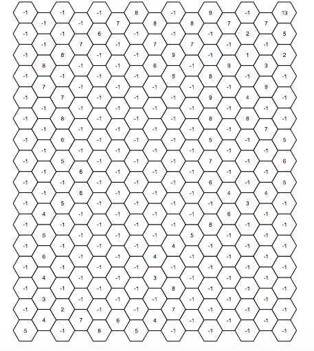
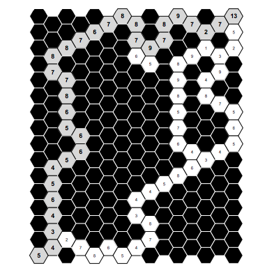

# optimal-hex-path
This program will calculate the optimal path for traveling through a weighted hexagonal graph using Dijkstra's algorithm. There is no visual representation of this yet, but that will come soon. The numbers can be changed from the input.txt file.

The -1's can be thought of as infinite numbers for this example.

